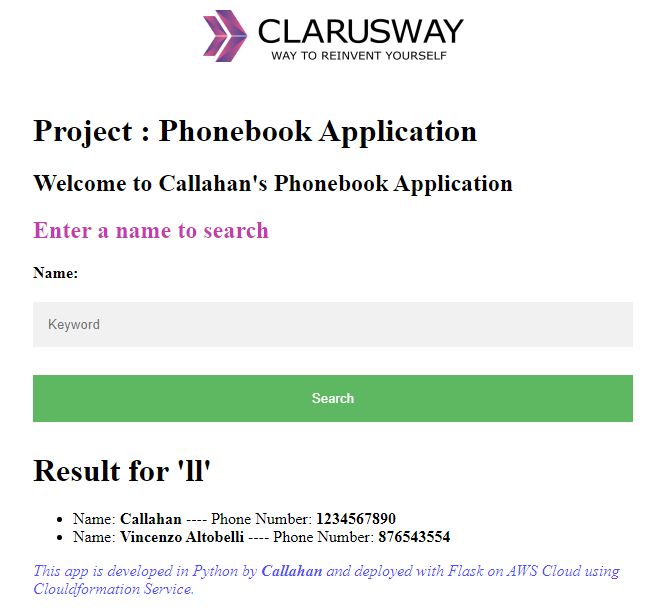

# Phonebook Application — Python Flask on AWS with Terraform

> **Full AWS infrastructure provisioned from a single Terraform file.** ALB, Auto Scaling Group, EC2 Launch Template, and RDS MySQL 8.4 — all defined as code. Deployed, tested, and destroyed with one command. Zero AWS console clicks.

---

## Table of Contents

- [Expected Outcome](#expected-outcome)
- [Overview](#overview)
- [Architecture Diagram](#architecture-diagram)
- [AWS Services Used](#aws-services-used)
- [Key Design Decisions](#key-design-decisions)
- [Tech Stack](#tech-stack)
- [Deployment](#deployment)
- [Testing](#testing)
- [Production Improvements Identified](#production-improvements-identified)

---

## Expected Outcome

The screenshot below shows the live Phonebook Application after `terraform apply` completed. The search for "ll" returns contacts from the live RDS MySQL 8.4 database — confirming the full CRUD pipeline working against real AWS infrastructure provisioned entirely by Terraform.



*Live deployment — Flask Phonebook running on EC2 Auto Scaling Group behind an ALB, querying RDS MySQL 8.4. Entire stack provisioned with one `terraform apply`. Zero console clicks.*

---

## Overview

This project demonstrates Infrastructure as Code in practice. A Python Flask phonebook app is deployed on AWS — but the focus is the infrastructure: every resource defined in a single `main.tf` and provisioned from the command line.

The architecture follows AWS security best practices with security group chaining, automated EC2 bootstrapping via Launch Template user data, and an output variable that prints the live URL immediately after apply.

**The goal: prove that infrastructure can be reproducible, version-controlled, and fully automated.**

---

## Architecture Diagram

```
TERRAFORM (main.tf)
terraform init -> terraform plan -> terraform apply
        |
        | Provisions all resources in dependency order
        v
+-----------------------------------------------+
|              AWS REGION (us-east-1)            |
|                                               |
|  SG (ALB)          SG (EC2)        SG (RDS)  |
|  HTTP 80           HTTP 80         MySQL 3306 |
|  from 0.0.0.0/0    from ALB SG     from EC2 SG|
|       |                 |               |      |
|       v                 v               |      |
|  Application       Auto Scaling         |      |
|  Load Balancer     Group                |      |
|  (Internet-facing) Desired 2            |      |
|       |            Min 1 / Max 3        |      |
|       |            ELB health checks    |      |
|       |                 |               |      |
|  Output: ALB URL        v               |      |
|  printed on apply  Launch Template      |      |
|                    Amazon Linux 2       |      |
|                    User data: Flask     |      |
|                         |               |      |
|                         v               |      |
|                    EC2 Instances  ------+      |
|                    Flask :80      RDS MySQL 8.4|
+-----------------------------------------------+

GitHub -> EC2 User Data -> Flask starts on boot (zero manual steps)
```

### Terraform Workflow

```
terraform init    -> Downloads AWS provider
terraform plan    -> Dry run (shows + creates, ~ modifies, - destroys)
terraform apply   -> Provisions all resources
                     Output: app_url = "http://your-alb.elb.amazonaws.com"
terraform destroy -> Removes all resources cleanly
```

---

## AWS Services Used

| Service | Terraform Resource | Configuration |
|---|---|---|
| **ALB** | `aws_lb` | Internet-facing · All AZs |
| **ALB Target Group** | `aws_lb_target_group` | HTTP 80 · Health check on `/` |
| **ALB Listener** | `aws_lb_listener` | Port 80 → forward |
| **Auto Scaling Group** | `aws_autoscaling_group` | Desired 2 · Min 1 · Max 3 · 300s grace |
| **Launch Template** | `aws_launch_template` | Amazon Linux 2 · t2.micro · User data |
| **RDS MySQL 8.4** | `aws_db_instance` | db.t3.micro · 20GB |
| **SG (ALB)** | `aws_security_group` | HTTP 80 from 0.0.0.0/0 |
| **SG (EC2)** | `aws_security_group` | HTTP 80 from ALB SG only |
| **SG (RDS)** | `aws_security_group` | MySQL 3306 from EC2 SG only |
| **Output** | `output` | ALB DNS URL printed on apply |

---

## Key Design Decisions

### 1. Security Group Chaining via Terraform References
EC2 SG rule references `aws_security_group.alb_sg.id` directly. Terraform creates ALB SG first, captures the ID, and wires it into EC2 SG automatically. Security group chaining enforced in code.

### 2. RDS Endpoint Injected via Terraform References
Referenced `${aws_db_instance.main.endpoint}` in the Launch Template user data. Terraform provisions RDS first, then injects the endpoint. Zero hardcoded endpoints.

### 3. Terraform Output Variable for Live URL
Output block for `aws_lb.main.dns_name`. Printed to terminal on apply. Zero console navigation needed.

### 4. Zero-Touch EC2 Bootstrapping
Launch Template user data installs Python, Flask, MySQL connector, clones from GitHub, and starts Flask on port 80. Every instance is serving traffic before its first ELB health check.

### 5. Credentials as Terraform Variables
DB username and password declared as input variables. Passed at apply time via `-var` flags. Never hardcoded in config or version control.

---

## Tech Stack

| Category | Technology |
|---|---|
| **Application** | Python 3 · Flask · MySQL connector |
| **IaC** | Terraform (HCL) |
| **Compute** | EC2 Amazon Linux 2 · Auto Scaling · Launch Template |
| **Load Balancing** | Application Load Balancer |
| **Database** | RDS MySQL 8.4 (db.t3.micro) |
| **State** | Terraform local state (tfstate) |

---

## Deployment

### Prerequisites

```bash
terraform -v
aws configure
aws sts get-caller-identity
```

### Deploy

```bash
# 1. Clone repo
git clone https://github.com/Drezzym6/YOUR_REPO_NAME.git
cd YOUR_REPO_NAME

# 2. Init
terraform init

# 3. Plan (dry run)
terraform plan \
  -var="db_username=YOUR_USERNAME" \
  -var="db_password=YOUR_PASSWORD"

# 4. Apply
terraform apply \
  -var="db_username=YOUR_USERNAME" \
  -var="db_password=YOUR_PASSWORD"
# type 'yes'

# Output:
# app_url = "http://your-alb-xxxx.us-east-1.elb.amazonaws.com"
```

### Destroy

```bash
terraform destroy \
  -var="db_username=YOUR_USERNAME" \
  -var="db_password=YOUR_PASSWORD"
# All resources removed cleanly. Zero orphaned resources.
```

---

## Testing

Tested on live AWS deployment after `terraform apply`:

### CRUD Operations

| Operation | Test | Result |
|---|---|---|
| Search | Empty database | Empty result page |
| Add | Name: `joHn doE`, Phone: `4706529754` | Stored as `John Doe` (title case) |
| Update | Change phone number | Record updated in RDS |
| Delete | Remove a contact | Record removed from RDS |

### Input Validation

| Input | Field | Expected | Status |
|---|---|---|---|
| `` (empty) | Name | Invalid: Name cannot be empty | ✅ |
| `62267` | Name | Invalid: Name must be text | ✅ |
| `` (empty) | Phone | Invalid: Phone cannot be empty | ✅ |
| `thousand` | Phone | Invalid: Phone must be numeric | ✅ |

### Infrastructure

| Check | Status |
|---|---|
| EC2 registered with ALB target group | ✅ |
| Health checks passing after grace period | ✅ |
| Flask running on port 80 via user data | ✅ |
| RDS MySQL accepting connections from EC2 | ✅ |
| ALB DNS URL accessible immediately after apply | ✅ |
| `terraform destroy` removed all resources cleanly | ✅ |

---

## Production Improvements Identified

| Improvement | Reason |
|---|---|
| **Remote Terraform state** | S3 backend + DynamoDB locking — shared, durable state |
| **Modular Terraform structure** | Split into networking, compute, database modules |
| **Secrets Manager** | DB credentials via data source at runtime |
| **HTTPS on ALB** | ACM certificate + HTTP→HTTPS redirect |
| **Custom VPC** | Private subnet isolation for EC2 and RDS |
| **Auto Scaling target tracking** | CPU-based policy for automatic capacity |

---

## Author

**Andre Diya** — Junior Cloud & DevOps Engineer · Atlanta, GA
AWS Certified Solutions Architect Associate · AWS Certified Cloud Practitioner

- LinkedIn: [linkedin.com/in/andre-diya](https://linkedin.com/in/andre-diya)
- GitHub: [github.com/Drezzym6](https://github.com/Drezzym6)
- Email: andrediya01@gmail.com
